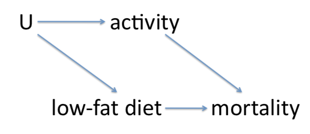

```{r setup, include=FALSE}
knitr::opts_chunk$set(echo = TRUE)
```

```{r table, warning=FALSE, message=FALSE, echo=FALSE}
library(dplyr)
library(readr)
library(knitr)
library(epitools)
library(foreign)

```

1. The data set `diet.dta` on bCourses contains three variables: `act` measures physical activity (`act`=0,1,2,3), with higher values corresponding to higher activity levels; `diet` is an indicator variable for a low-fat diet (1 = low-fat diet, 0 = other diet); `mort` is an indicator variable for death by the end of the study (1= dead, 0 = alive). We are interested in studying the effect of low-fat diet on all-cause mortality, but are concerned that the relationship might be confounded by physical activity. The table below summarizes the available data. In questions (a)-(i) calculate by hand; in question (j) check your results in R and show your output.
``` {r table_1, echo=FALSE}
activity_0 <- data.frame("Diet"=c("Low-fat Diet", "Other Diet"),  "Dead"=c(17,75), "Alive"=c(22,75))
activity_1 <- data.frame("Diet"=c("Low-fat Diet", "Other Diet"),  "Dead"=c(28,40), "Alive"=c(36,45))
activity_2 <- data.frame("Diet"=c("Low-fat Diet", "Other Diet"),  "Dead"=c(10,14), "Alive"=c(37,34))
activity_3 <- data.frame("Diet"=c("Low-fat Diet", "Other Diet"),  "Dead"=c(4,7), "Alive"=c(24,32))
kable(activity_0, caption="Activity Level 0")
kable(activity_1, caption="Activity Level 1")
kable(activity_2, caption="Activity Level 2")
kable(activity_3, caption="Activity Level 3")
```

(a) Set up a pooled 2 × 2 table and calculate a point estimate and confidence interval for the crude odds ratio for the risk of mortality comparing low-fat diet to other diets.

``` {r 1a, echo=FALSE}
diet <- data.frame("Diet"=c("Low-fat diet", "Other diet"), "Dead"=c(59, 136), "Alive"=c(119, 186))
kable(diet, caption="Mortality")
```
$$\hat{OR} = \frac{59 \times 186}{119 \times 136} = 0.6781$$
$$\hat{var}\big(\log{(\hat{OR})}\big) = \frac{1}{59} + \frac{1}{136} + frac{1}{119} + \frac{1}{186} = 0.03808$$
$$\text{95% CI for } \log{(OR)} = \log{0.6781} \pm 1.96\sqrt{0.03808} = (-0.771, -0.006)$$
$$\text{95% CI for } OR = (\exp(-0.771), \exp(-0.006)) = (0.46, 0.99)$$

(b) Draw a causal graph to reflect the relationship between low-fat diet, physical activity, and mortality. Based on your graph, is the crude odds ratio you calculated in (a) likely to be a good estimate of the causal odds ratio comparing low-fat diet to other diets?

The DAG would probably look like this:

``` {r 1b, echo=FALSE}

```

(c) For each of the four strata of physical activity, calculate a point estimate for the odds ratio comparing low-fat diet to other diets.
$$\hat{OR}_0  = \frac{17 \times 75}{75 \times 22} = 0.77$$
$$\hat{OR}_1  = \frac{28 \times 45}{40 \times 36} = 0.88$$
$$\hat{OR}_2  = \frac{10 \times 34}{14 \times 37} = 0.66$$
$$\hat{OR}_3  = \frac{4 \times 32}{7 \times 24} = 0.76$$

(d) Based on your results in (c), does it seem plausible that the effect of low-fat diet on mortality (as measured on the odds ratio scale) is the same in all four groups of physical activity?

Yes, the four separate odds ratio estimates are all fairly close together.

(e) Let’s assume for the remainder of this question that the effect of low-fat diet on mortality is in fact the same at all four levels of physical activity. Carry out the Cochran-Mantel-Haenszel test to evaluate the null hypothesis that low-fat diet is not associated with mortality in any of the four strata of physical activity. What is the alternative hypothesis of this test? What is your conclusion?

The alternative hypothesis is that $OR_0 = OR_1 = OR_2 = OR_3 \neq 1$.
$$\chi^2_{CMH} = \frac{(59 - 64.663)^2}{23.694} = 1.353$$
$$p = 0.245 \text{ (from chi squared distribution)}$$

Based on the CMH test, we do not reject the null at the .05 level. In other words, this test does not provide support for the conjecture that low-fat diet is associated with mortality after controlling (stratifying) on activity level (assuming no multiplicative interaction).

(f) Calculate an individual $\chi^2$-statistic for testing independence between low-fat diet and mortality in each stratum. Compare the sum of these four statistics against a $\chi^2$ distribution with four degrees of freedom. What is the alternative hypothesis for the test that you just calculated a p-value for? Compare your p-value to the one you calculated in (e) and explain any difference you might see.

The alternative hypothesis for this test is that at least one of the stratum-specific ORs is not equal to 1 (i.e., the alternative is that there is a relationship between low-fat diet and mortality in at least one of the stratum, making no assumption regarding statistical interactions). Notice the difference between this null hypothesis and the one in (e), in particular that there is no assumption here of no multiplicative interaction so that this alternative is broader. Here is a table summarizing the information we need:

``` {r 1f, echo=FALSE}
chi_square_activity <- data.frame("Activity Level"=c(0,1,2,3), "Chi-Square"=c(0.51, 0.16, 0.78, 0.16))
kable(chi_square_activity)
```

Lower power because alternative hypothesis is broader.

(g) Calculate a Mantel-Haenszel point estimate for the summary odds ratio.

Here is a table summarizing the information we need:

``` {r 1g, echo=FALSE}
point_estimate_table <- data.frame("Activity Level"=c(0,1,2,3), "ad/n"=c(6.746, 8.456, 3.579, 1.910), "bc/n" = c(8.730, 9.664, 5.453, 2.507))
kable(point_estimate_table)
```
$$\hat{OR}_{MH} = \frac{20.691}{26.354} = 0.79$$

(h) Calculate a Woolf estimate and corresponding 95% confidence interval for the summary odds ratio.
\vspace{200pt}

Here is a table summarizing the information we need:

``` {r 1h, echo=FALSE}
woolf <- data.frame("Activity Level"=c(0,1,2,3), "log or"=c(-0.251, -0.131, -0.406, -0.228), "bc/n" = c(7.801, 9.161, 4.548, 2.341))
kable(woolf)
```
$$\log{\hat{OR}_W} = \frac{(-0.251) \times 7.801 + ... + (-0.228) \times 2.341}{23.859} = -0.232$$
$$hat{OR}_W = \exp{(-0.232)} = 0.793$$
$$\hat{var}\Big(\log{(\hat{OR}_W)} \Big) = \frac{1}{23.859} = 0.0419$$
$$\text{95% CI for log(OR)} = -0.232 \pm 1.96 \sqrt{0.0419} = (-0.633, 0.169)$$
$$\text{95% CI for OR} = (0.53, 1.18)$$

(i) Compare your two adjusted estimates in (g) and (h) to the crude estimate in (a). Is the relationship between low-fat diet and mortality confounded?

Yes, since the adjusted estimated is substantially different from the crude estimate, there is confounding (we know from the DAG above that activity is neither a collider nor on the causal pathway so non-collapsibility and confounding are equivalent here).

(j) Check your calculations for (a), (c), (e), and (g) in R and show your output. You will need to use `epitab()` and `mantelhaen.test()`.

```{r}
# (a)
epitab(c(59, 119, 136, 186))

# (c)
epitab(c(17, 22, 75, 75))$tab
epitab(c(28, 36, 40, 45))$tab
epitab(c(10, 37, 14, 34))$tab
epitab(c(4, 24, 7, 32))$tab

# (e)
mantelhaen.test(
array(c(17, 22, 75, 75,
  28, 36, 40, 45,
  10, 37, 14, 34,
  4, 24, 7, 32), dim = c(2, 2, 4)), 
  correct = FALSE)

# (g)
mantelhaen.test(
array(c(17, 22, 75, 75,
        28, 36, 40, 45,
        10, 37, 14, 34,
        4, 24, 7, 32), dim = c(2, 2, 4)), 
        correct = FALSE)$conf.int
```
