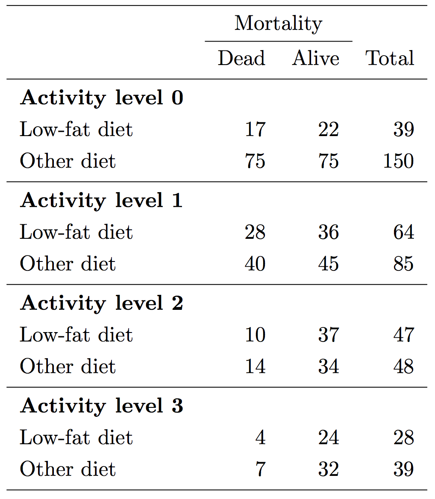

```{r setup, include=FALSE}
knitr::opts_chunk$set(echo = TRUE)
```

```{r table, warning=FALSE, message=FALSE, echo=FALSE}
library(dplyr)
library(readr)
library(knitr)
library(epitools)
library(foreign)

```

1. The data set `diet.dta` on bCourses contains three variables: `act` measures physical activity (`act`=0,1,2,3), with higher values corresponding to higher activity levels; `diet` is an indicator variable for a low-fat diet (1 = low-fat diet, 0 = other diet); `mort` is an indicator variable for death by the end of the study (1= dead, 0 = alive). We are interested in studying the effect of low-fat diet on all-cause mortality, but are concerned that the relationship might be confounded by physical activity. The table below summarizes the available data. In questions (a)-(i) calculate by hand; in question (j) check your results in R and show your output.



(a) Set up a pooled 2 × 2 table and calculate a point estimate and confidence interval for the crude odds ratio for the risk of mortality comparing low-fat diet to other diets.
\newpage

(b) Draw a causal graph to reflect the relationship between low-fat diet, physical activity, and mortality. Based on your graph, is the crude odds ratio you calculated in (a) likely to be a good estimate of the causal odds ratio comparing low-fat diet to other diets?
\vspace{180pt}

(c) For each of the four strata of physical activity, calculate a point estimate for the odds ratio comparing low-fat diet to other diets.
\vspace{180pt}

(d) Based on your results in (c), does it seem plausible that the effect of low-fat diet on mortality (as measured on the odds ratio scale) is the same in all four groups of physical activity?
\newpage

(e) Let’s assume for the remainder of this question that the effect of low-fat diet on mortality is in fact the same at all four levels of physical activity. Carry out the Cochran-Mantel-Haenszel test to evaluate the null hypothesis that low-fat diet is not associated with mortality in any of the four strata of physical activity. What is the alternative hypothesis of this test? What is your conclusion?
\newpage

Based on the CMH test, we do not reject the null at the .05 level. In other words, this test does not provide support for the conjecture that low-fat diet is associated with mortality after controlling (stratifying) on activity level (assuming no multiplicative interaction).

(f) Calculate an individual $\chi^2$-statistic for testing independence between low-fat diet and mortality in each stratum. Compare the sum of these four statistics against a $\chi^2$ distribution with four degrees of freedom. What is the alternative hypothesis for the test that you just calculated a p-value for? Compare your p-value to the one you calculated in (e) and explain any difference you might see.
\vspace{200pt}

(g) Calculate a Mantel-Haenszel point estimate for the summary odds ratio.
\vspace{200pt}

(h) Calculate a Woolf estimate and corresponding 95% confidence interval for the summary odds ratio.
\vspace{200pt}

(i) Compare your two adjusted estimates in (g) and (h) to the crude estimate in (a). Is the relationship between low-fat diet and mortality confounded?
\newpage

(j) Check your calculations for (a), (c), (e), and (g) in R and show your output. You will need to use `epitab()` and `mantelhaen.test()`.

```{r}
# (a)
epitab(c(59, 119, 136, 186))

# (c)
epitab(c(17, 22, 75, 75))$tab
epitab(c(28, 36, 40, 45))$tab
epitab(c(10, 37, 14, 34))$tab
epitab(c(4, 24, 7, 32))$tab

# (e)
mantelhaen.test(
array(c(17, 22, 75, 75,
  28, 36, 40, 45,
  10, 37, 14, 34,
  4, 24, 7, 32), dim = c(2, 2, 4)), 
  correct = FALSE)

# (g)
mantelhaen.test(
array(c(17, 22, 75, 75,
        28, 36, 40, 45,
        10, 37, 14, 34,
        4, 24, 7, 32), dim = c(2, 2, 4)), 
        correct = FALSE)$conf.int
```
